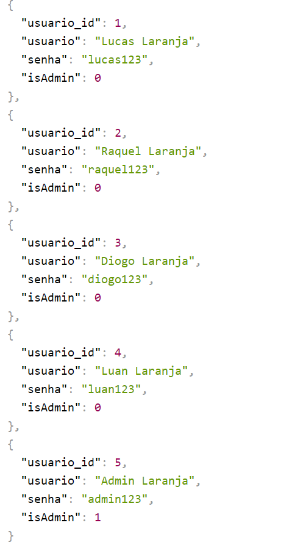

# 

     

 # Orange Evolution

Orange Evolution é a plataforma de estudos em áreas de tecnologia com trilhas de conteúdos bem definidos, acompanhamento do seu progresso e em diversas mídias. Criado como projeto do hackathon do Programa de Formação do Grupo FCâmara Season 4, tem como intenção ser uma reelaboração da plataforma existente.

# Índice
* [Logo do projeto](#Logo-Evolution)
* [Orange Evolution](#Orange-Evolution)
* [Pré requisitos](#Pré-requisitos)
* [Instalação](#Instalação)
* [Utilização da plataforma](#Utilização-da-plataforma)
  * [Landing page](#Landing-page)
  * [Página inicial usuário](#Página-inicial-usuário)
  * [Página inicial administrador](#Página-inicial-administrador)
  * [Páginas de trilha](#Páginas-de-trilha)
  * [Página de trilha administrador](#Página-de-trilha-administrador)
* [Funcionalidades](#Funcionalidades)
* [Funcionalidades futuras](#Funcionalidades-futuras)
* [Tecnologias utilizadas](#Tecnologias-utilizadas)
* [Responsividade](#Responsividade)
* [Agradecimentos](#Agradecimentos)
* [Autores](#Autores)

### Pré requisitos 
O que é necessário ter instalado para rodar a aplicação?
```bash
Node.js (Recomendamos procurar e instalar a versão LTS)
```

## Instalação
O backend da aplicação pode ser encontrado no seguinte link:
<https://github.com/LucasBinho/OrangeEvolutionBackEnd>

## Utilização da plataforma

### Usuários Cadastrados no Banco
É possível fazer login no site para o acesso as páginas de usuário (com os campos de login e senha vazios) ou para a página de admnistrador (com o botão de Login como Administrador), porém, também é possível fazer o teste de integração com o banco de dados, se for utilizado um dos usuários já cadastrados, como é mostrado na imagem abaixo:




### Landing page
Através do sitemap elaborado pelo departamento de UX, sua jornada na plataforma se inicia pela landing page, que o direcionará para a página de login para a validação das credenciais de usuário.

### Página inicial usuário
Aqui você terá a oportunidade de escolher entre uma ou várias das trilhas disponíveis para iniciar sua jornada de estudos.

### Página inicial administrador
Para os usuários com perfil de administrador, as trilhas terão a mesma apresentação, porém com a opção de alteração no conteúdo.

### Páginas de trilha
Esta página apresentará a sequência de conteúdos, mostrando o assunto da aula,  a duração estimada, a página de origem e o status de conclusão.

### Página de trilha administrador
Tendo os conteúdos apresentados da mesma forma que na página de trilhas do estudando, nesta variação temos a possibilidade de adicionar ou excluir conteúdos.

## Funcionalidades
  + Usuário Aluno:
    - Possibilidade de escolher uma ou mais trilhas para estudar
    - Recurso de marcação do conteúdo como visualizado ou pendente
    - Barra de progresso na tela principal para acompanhar a evolução na trilha


  + Usuário Admnistrador
    - Alternativa de excluir, editar ou inserir novos conteúdos a qualquer momento


## **Validação ao adicionar novos conteúdos (**IMPORTANTE!**):**
 - É muito importante que, ao adicionar um novo conteúdo na trilha, a inserção dos dados seja feita de forma correta para que tudo passe na validação do banco de dados e um novo conteúdo seja adicionado com sucesso. 
 O nome do conteúdo deve possuir mais de 4 letras:
 ```
 Ex:
 Curso X
```
O campo link deve ser realmente um link url:
 ```
 Ex:
 https://github.com/
```
O campo duração deve obedecer a ordem de número e texto:
 ```
 Ex:
 17 minutos
 1 hora
```
O campo origem só precisa ser um texto com mais de 2 caracteres;
 ```
 Ex:
 GIT
```
**O campo tipo é muito importante, e para a inserção correta de uma nova aula o campo tipo possui as seguintes opções:**
 ```
Artigo FullStack
Video FullStack
Curso FullStack

Artigo UX/UI
Video UX/UI
Curso UX/UI

Artigo QA
Video QA
Curso QA
```

## Funcionalidades futuras
* Futuramente haverá também a opção de editar uma trilha já existente
* Serão também implementados os alertas para uma confirmação na adição, edição e exclusão de conteúdos

## Tecnologias utilizadas
* HTML
* CSS
* Bootstrap
* JavaScript
* Node
* SQLite

## Responsividade
Todas as telas foram elaboradas de forma a apresentar recursos responsivos para os principais tamanhos de telas de dispositivos.

## Agradecimentos
Expressamos a profunda gratidão do grupo por todo o apoio de nossos mentores e padrinhos do grupo FCamara ao longo da jornada de concepção e elaboração do projeto.

# Autores
 [Raquel Ribeiro](https://www.behance.net/raquelalribeiro)
 [Lucas Passos](https://github.com/LucasBinho) 
 [Diogo Lima](https://github.com/diogoOLima) 
 [Luan Moreira](https://github.com/luanmoreira59)
